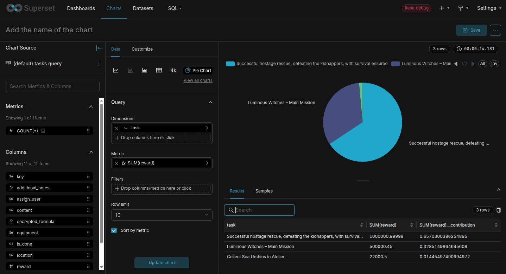

SQLAlchemy dialect for google cloud datastore(firestore mode)
========================
How to install
```
python3 setup.py install
```
SQLAlchemy
```python
from sqlalchemy import *
from sqlalchemy.engine import create_engine
from sqlalchemy.schema import *
engine = create_engine('datastore://test-api-1', credentials='path/to/credentials.json')
conn = engine.connect()
result = conn.execute("SELECT * from test_table)
print(result.fetchall())
```

## Preview



## References
- [Develop a SQLAlchemy dialects](https://hackmd.io/lsBW5GCVR82SORyWZ1cssA?view)
