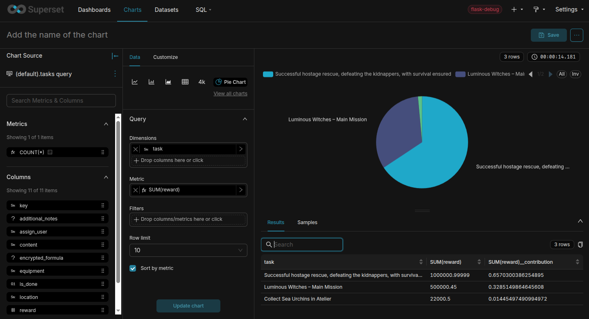

SQLAlchemy dialect for Google Cloud Datastore in Firestore mode
========================

## Installation

Install from PyPI:
```bash
pip install python-datastore-sqlalchemy
```

Install from a local checkout:
```bash
uv pip install -e .
```

Runtime dependencies are declared in `pyproject.toml`. `requirements.txt` is not used by this project.

## Usage

```python
from sqlalchemy import create_engine, text

engine = create_engine(
    "datastore://my-project/?database=my-db",
    credentials="path/to/credentials.json",
)

with engine.connect() as conn:
    result = conn.execute(text("SELECT * FROM test_table"))
    print(result.fetchall())
```

## Preview



> [!WARNING]
> Please note: Not all GQL and SQL syntax has been fully tested. Should you encounter any bugs, please post the relevant query and open an issue on GitHub.

## How to contribute

Feel free to open issues and pull requests on GitHub.

## Development

This project supports Python 3.10 and newer. It uses a uv-managed virtual environment by default. The lockfile is tracked so local development and CI use the same dependency resolution.

Install the development environment:
```bash
uv sync --locked
```

Run the test suite:
```bash
uv run pytest
```

The Datastore-backed tests require the Google Cloud SDK with the `beta` and `cloud-datastore-emulator` components installed. If `gcloud` is not on `PATH`, point the test fixture at it explicitly:
```bash
GCLOUD_PATH=/path/to/google-cloud-sdk/bin/gcloud uv run pytest
```

## Development Notes

- [Develop a SQLAlchemy and its dialects](https://hackmd.io/lsBW5GCVR82SORyWZ1cssA?view)
